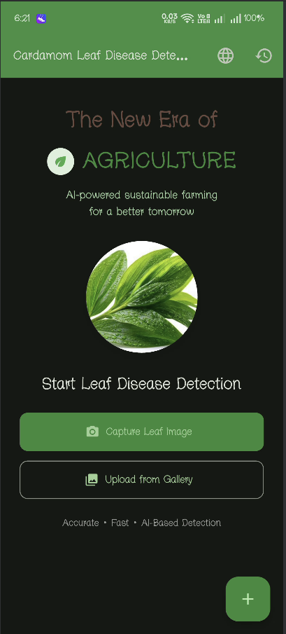
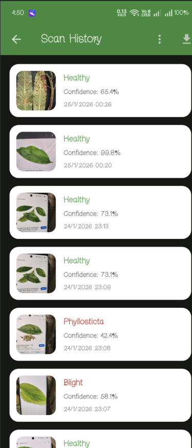
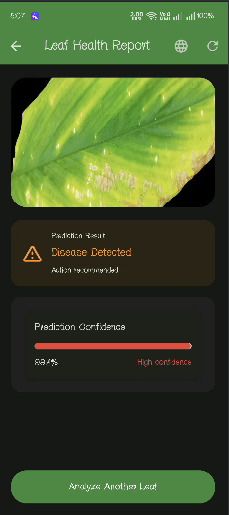
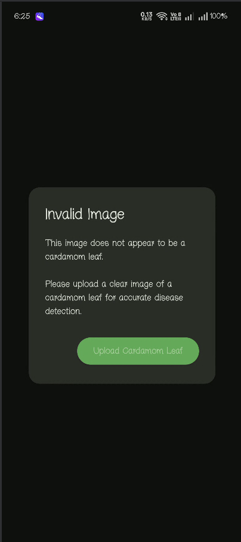

# 🌿 Cardamom Leaf Disease Detection App

An AI-powered mobile application built with **Flutter** and **TensorFlow Lite** to detect diseases in **cardamom leaves**. The app uses a **multi-stage validation pipeline** to ensure reliable predictions and to **reject invalid or non-cardamom images**.

---
## 🚀 Features

* 📸 Capture leaf image using camera
* 🖼️ Upload leaf image from gallery
* 🤖 AI-based disease detection (Healthy / Blight / Phyllosticta)
* 🌫️ Blur detection for low-quality images
* 📊 Confidence score with visual indicator
* 🩺 Severity-based recommendations (Mild / Moderate / Severe)
* 🗂️ Scan history with filter, select-all, and delete options
* 🌐 Language toggle (English / Hindi)

---

## 📱 Screenshots

### 🏠 Home Screen


### 📜 Scan History


### 🧪 Disease Detection Result


### ❌ Invalid Image Rejection


---

## 🛠️ Tech Stack

* **Flutter** (UI)
* **Dart** (Logic)
* **TensorFlow Lite** (ML inference)
* **MobileNet-based CNN models**
* **Path Provider** (local storage)

---

## 📂 Project Structure 

```
lib/
├── core/
|   ├── localization/
|   |     ├── app_strings.dart
│   |     └── app_language.dart
│   ├── models/
|   |     ├── sam_prompt.dart
│   ├     └── scan_result.dart
│   └── utils/
|        ├── image_cropper.dart
│        ├── image_quality.dart
|        ├── image_resize.dart
|        ├── leaf_validator.dart
│        └── image_validatior.dart
├── Features/
│     ├── camera
|     |      ├── camera_screnn.dart
|     |      ├── full_image_viewer.dart
|     |      ├── image_preview_screen.dart
|     |      └── sam_interaction_screen.dart
│     ├── history
|     |       └── history.dart
│     ├── navigation
|     |      ├── home_screen.dart
|     |      └── main_navigation.dart
│     └── result
|             └── result.dart
├── services/
│      ├── ml
|      |     ├── classifier.dart
|      |     ├── inference_isolate.dart
|      |     ├── sam_service.dart
|      |     └── tflite_service.dart
|      ├── model_service.dart
|      ├── prediction_cache.dart
│      └── scan_storage.dart
├── widgets/
|   ├── agri_helpine_button.dart
|   ├── confidence_bar.dart
|   ├── guideline_tflite.dart
|   ├── language_option_tile.dart
│   ├── loading_overlay.dart
│   └── weather_warning_card.dart
└── main.dart
```

---

## ⚙️ How to Run

1. Clone the repository
2. Run `flutter pub get`
3. Connect an Android device or emulator
4. Run `flutter run`


## 📄 License

This project is for academic and demonstration purposes.
